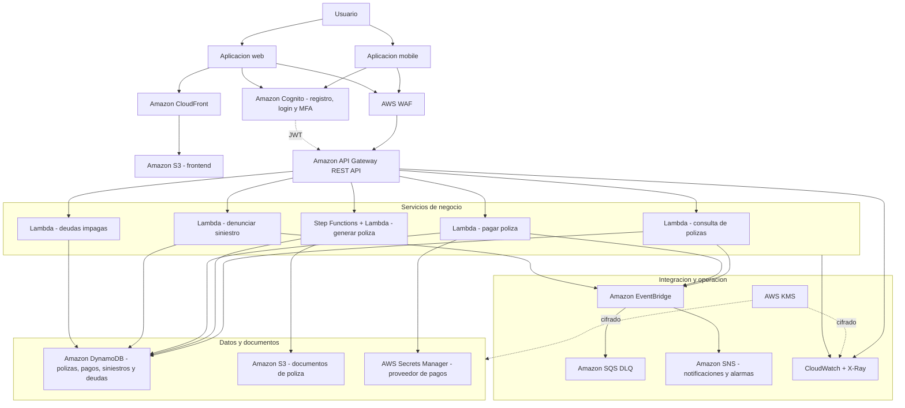

# Arquitectura AWS

## Relacion con las features

| Feature | Componentes principales |
|---|---|
| Aplicacion mobile | Cognito, API Gateway, CloudFront para contenido compartido si aplica |
| Aplicacion web | S3 privado, CloudFront, Cognito |
| Registro y login | Cognito User Pool, OAuth 2.0 Authorization Code + PKCE, MFA opcional |
| Pago de polizas | API Gateway, Lambda Payments, Secrets Manager, DynamoDB, EventBridge |
| Generacion de poliza | Step Functions, Lambda, DynamoDB y S3 para PDF/documentos |
| Denuncia de siniestro | API Gateway, Lambda Claims, DynamoDB, EventBridge |
| Deudas impagas | API Gateway, Lambda Debts y DynamoDB |

## Decisiones

- El backend es serverless para reducir operacion y escalar por demanda.
- API Gateway valida JWT emitidos por Cognito antes de invocar las Lambdas.
- DynamoDB usa modo on-demand, cifrado KMS y point-in-time recovery.
- Los documentos son privados, versionados y cifrados en S3.
- EventBridge permite integrar notificaciones, cobranzas, fraude y sistemas legacy sin acoplarlos a la API.
- El proveedor de pagos es externo; Terraform solo crea el secreto donde se cargan sus credenciales. No almacena datos de tarjeta.
