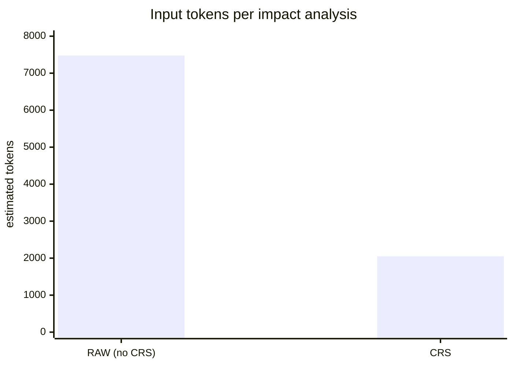
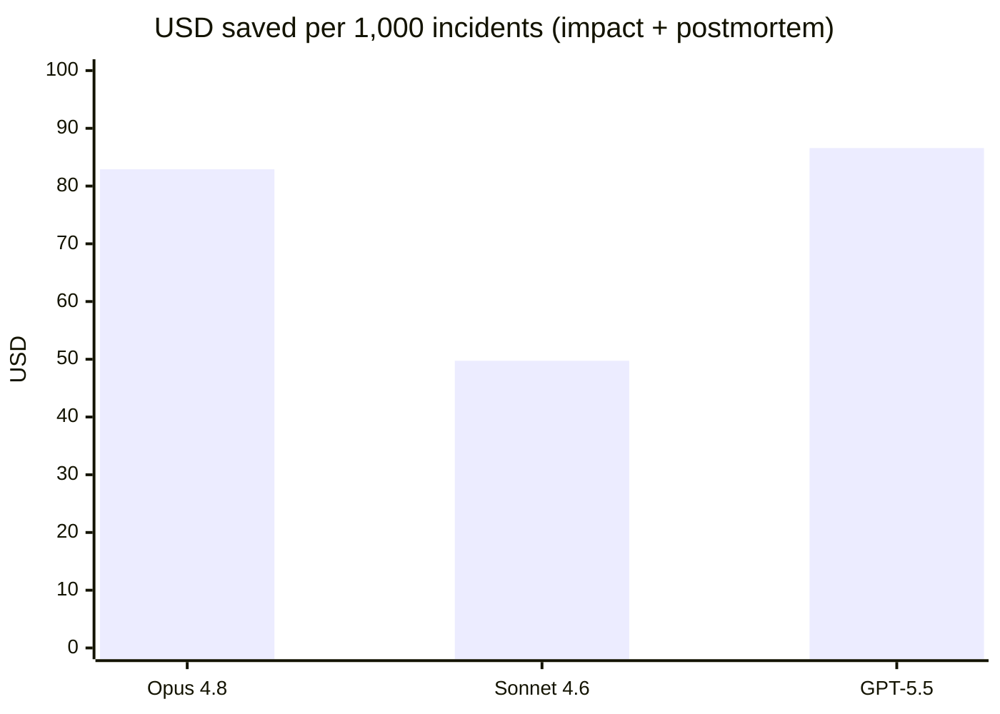

# Benchmark — "What happens if I delete the DynamoDB database?"

> Spanish version: [docs/es/benchmark-eliminacion-dynamodb.md](es/benchmark-eliminacion-dynamodb.md)

- **Date:** 2026-06-10
- **Repository:** `aws-reference-example` (insurance platform — 11 `.tf` files, 96 nodes, 151 relationships in the CRS graph)
- **Question:** *"¿Qué pasa si elimino la base de datos DynamoDB?"*
- **Tool:** CRS v0.4.0 · **Models priced:** Claude Opus 4.8, Claude Sonnet 4.6, GPT-5.5
- **Hardware:** Windows 11, local execution

## Methodology and scope

This benchmark compares two ways of answering the question:

- **RAW mode (without CRS):** the LLM receives all `.tf` files of the repository as context, analyzes the impact, and writes the postmortem.
- **CRS mode:** CRS resolves the component on the local graph, computes the blast radius deterministically, sends only the relevant subgraph to the LLM, and generates the postmortem draft locally (zero LLM tokens).

What is real vs. estimated:

| Measurement | Source |
| --- | --- |
| Detection time, indexing time, postmortem time | **Measured** on this machine (3 runs for `crs ask`). |
| Token counts | **Measured prompt sizes**, converted with the `ceil(chars / 4)` estimator used by `crs benchmark-tokens`. |
| Dollar figures | Computed from **official list pricing** (2026-06-10): Opus 4.8 $5/$25, Sonnet 4.6 $3/$15, GPT-5.5 $5/$30 per million input/output tokens. |
| Live API calls | **Not performed** (no API credentials on this machine). LLM wall-clock latency therefore is not reported; see *Level B protocol* below to add it. |

## 1. Impact detection — correctness first

A token saving is worthless if the answer is wrong. CRS resolved the question to `root::aws_dynamodb_table.domain` (intent `impact`, confidence 0.739) and detected **11 affected components**:

```text
depth 1: data.aws_iam_policy_document.lambda          (IAM policy reading the table)
depth 1: aws_lambda_function.feature                  (business Lambda backed by the table)
depth 2: aws_iam_role_policy.lambda
depth 2: aws_api_gateway_integration.feature          (API used by mobile/web apps)
depth 2: aws_lambda_permission.api
depth 2: data.aws_iam_policy_document.step_functions
depth 2: aws_sfn_state_machine.policy_generation      (policy generation workflow)
depth 3: aws_api_gateway_deployment.main
depth 3: aws_iam_role_policy.step_functions
depth 3: output.policy_generation_state_machine_arn
depth 3: data.aws_iam_policy_document.start_policy_workflow
```

Deleting the table breaks the Lambda backend, the API Gateway integration serving the mobile/web apps, and the Step Functions policy-generation workflow — exactly the chain a human reviewer would need to find by reading the code.

## 2. Time

| Step | Without CRS | With CRS (measured) |
| --- | --- | --- |
| One-time indexing (`crs init`) | — | 0.38 s (96 nodes, 151 relationships) |
| Impact detection | LLM must ingest and analyze 11 files (requires live call — Level B) | **222 / 239 / 257 ms** (3 runs, avg ≈ 0.24 s, deterministic) |
| Postmortem draft | LLM generation (requires live call — Level B) | **233 ms**, generated locally |

With CRS the *detection* itself is local and sub-second; the LLM is only needed to narrate/extend the analysis. Without CRS, every step requires a full LLM round trip over the whole repository.

## 3. Tokens

Measured by `crs benchmark-tokens` on this repository and question:

| Mode | Input tokens | Scope |
| --- | ---: | --- |
| RAW (without CRS) | **7,478** | 11 Terraform files, full content |
| CRS | **2,050** | 9-node subgraph + decision + blast radius |
| **Saving** | **5,428 (−72.6 %, ratio 3.65×)** | |



For the **postmortem**, the asymmetry is bigger: without CRS the LLM re-ingests the repository (7,478 input tokens) and writes the document (≈ 735 output tokens, the size of the generated draft). With CRS, `crs postmortem` produces the draft locally: **0 LLM tokens**.

Full workflow (impact analysis + postmortem) per incident:

| Mode | Input tokens | Output tokens |
| --- | ---: | ---: |
| Without CRS | 7,478 + 7,478 = **14,956** | ≈ 735 |
| With CRS | **2,050** | 0 (local draft) |
| **Saved** | **12,906** | **735** |

## 4. Dollars

Cost per incident (impact analysis + postmortem), list pricing, no cache discounts:

| Model | Input $/M | Output $/M | Cost without CRS | Cost with CRS | **Saved / incident** | Saved / 1,000 incidents |
| --- | ---: | ---: | ---: | ---: | ---: | ---: |
| Claude Opus 4.8 | $5.00 | $25.00 | $0.0932 | $0.0103 | **$0.0829 (−89 %)** | **$82.91** |
| Claude Sonnet 4.6 | $3.00 | $15.00 | $0.0559 | $0.0062 | **$0.0497 (−89 %)** | **$49.74** |
| GPT-5.5 | $5.00 | $30.00 | $0.0968 | $0.0103 | **$0.0866 (−89 %)** | **$86.58** |



Reading the table:

- The **~89 % cost reduction is model-independent**; the absolute dollars scale with each model's price. GPT-5.5 shows the largest absolute saving because its output tokens are the most expensive ($30/M).
- This repository is small (11 files). The RAW cost grows with the whole repository, while the CRS cost grows only with the blast radius — in a real monorepo both the percentage and the dollars increase.
- With coding agents the real-world saving is larger: without CRS the agent also burns grep/read turns, each one re-sending accumulated context.
- Prompt caching (~0.1× on cached input reads) and batch APIs reduce the nominal gap; CRS's deterministic, stable-ordered output is designed to maximize those cache hits too.

## 5. Reproduce

```powershell
crs init aws-reference-example
crs ask aws-reference-example "que pasa si elimino la base de datos DynamoDB?" --json
crs benchmark-tokens aws-reference-example "que pasa si elimino la base de datos DynamoDB?"
crs postmortem aws-reference-example aws_dynamodb_table.domain --out postmortem-dynamodb.md
```

Evidence files are written to `aws-reference-example/.crs/benchmarks/`.

## Conclusion

For this use case, CRS detected the complete 11-component blast radius of deleting the DynamoDB table in **~0.24 s**, using **72.6 % fewer input tokens** for the analysis, and generated the postmortem draft **locally at zero token cost** — an end-to-end cost reduction of **~89 % per incident** on all three models (Opus 4.8, Sonnet 4.6, GPT-5.5).
