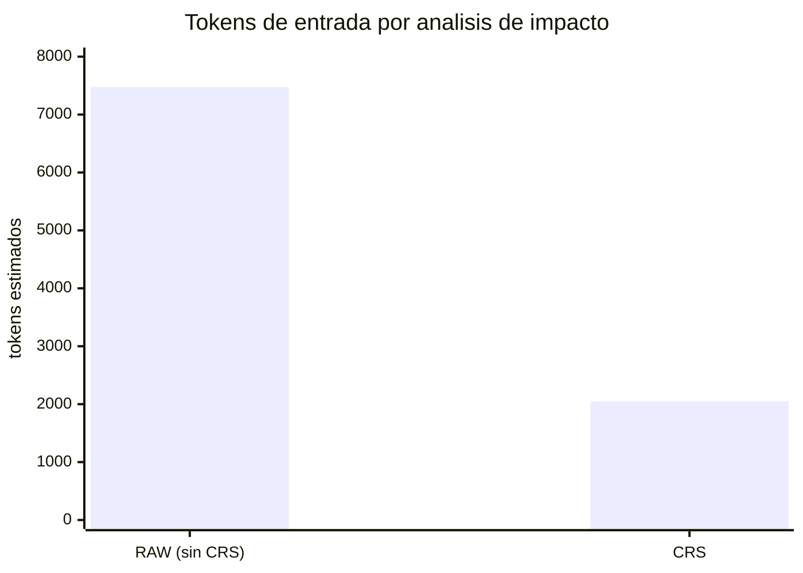
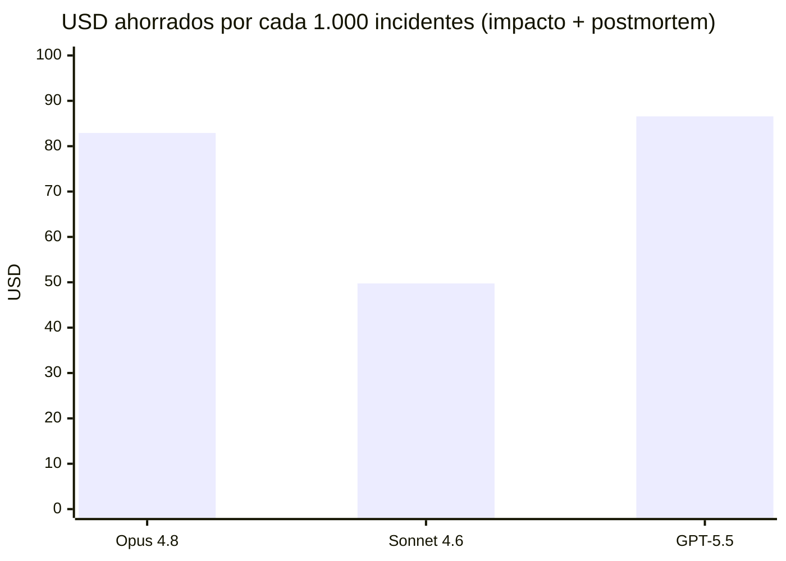

# Benchmark — "¿Qué pasa si elimino la base de datos DynamoDB?"

> English version: [docs/benchmark-dynamodb-deletion.md](../benchmark-dynamodb-deletion.md)

- **Fecha:** 2026-06-10
- **Repositorio:** `aws-reference-example` (plataforma de seguros — 11 archivos `.tf`, 96 nodos, 151 relaciones en el grafo CRS)
- **Pregunta:** *"¿Qué pasa si elimino la base de datos DynamoDB?"*
- **Herramienta:** CRS v0.4.0 · **Modelos cotizados:** Claude Opus 4.8, Claude Sonnet 4.6, GPT-5.5
- **Hardware:** Windows 11, ejecución local

## Metodología y alcance

El benchmark compara dos formas de responder la pregunta:

- **Modo RAW (sin CRS):** la LLM recibe todos los `.tf` del repositorio como contexto, analiza el impacto y redacta el postmortem.
- **Modo CRS:** CRS resuelve el componente sobre el grafo local, calcula el blast radius de forma determinista, envía a la LLM solo el subgrafo relevante y genera el borrador de postmortem localmente (cero tokens de LLM).

Qué es real y qué es estimado:

| Medición | Fuente |
| --- | --- |
| Tiempo de detección, indexación y postmortem | **Medido** en esta máquina (3 corridas para `crs ask`). |
| Conteo de tokens | **Tamaños de prompt medidos**, convertidos con el estimador `ceil(caracteres / 4)` de `crs benchmark-tokens`. |
| Cifras en dólares | Calculadas con **pricing oficial de lista** (2026-06-10): Opus 4.8 $5/$25, Sonnet 4.6 $3/$15, GPT-5.5 $5/$30 por millón de tokens entrada/salida. |
| Llamadas reales a la API | **No realizadas** (no hay credenciales en esta máquina). Por eso no se reporta latencia de LLM; ver el *protocolo Nivel B* para agregarla. |

## 1. Detección de impactos — primero la corrección

Un ahorro de tokens no vale nada si la respuesta es incorrecta. CRS resolvió la pregunta a `root::aws_dynamodb_table.domain` (intención `impact`, confianza 0.739) y detectó **11 componentes afectados**:

```text
depth 1: data.aws_iam_policy_document.lambda          (política IAM que lee la tabla)
depth 1: aws_lambda_function.feature                  (Lambda de negocio respaldada por la tabla)
depth 2: aws_iam_role_policy.lambda
depth 2: aws_api_gateway_integration.feature          (API que usan las apps mobile/web)
depth 2: aws_lambda_permission.api
depth 2: data.aws_iam_policy_document.step_functions
depth 2: aws_sfn_state_machine.policy_generation      (workflow de generación de pólizas)
depth 3: aws_api_gateway_deployment.main
depth 3: aws_iam_role_policy.step_functions
depth 3: output.policy_generation_state_machine_arn
depth 3: data.aws_iam_policy_document.start_policy_workflow
```

Eliminar la tabla rompe el backend Lambda, la integración de API Gateway que sirve a las apps mobile/web y el workflow de Step Functions que genera pólizas — exactamente la cadena que un revisor humano tendría que encontrar leyendo el código.

## 2. Tiempo

| Paso | Sin CRS | Con CRS (medido) |
| --- | --- | --- |
| Indexación única (`crs init`) | — | 0,38 s (96 nodos, 151 relaciones) |
| Detección de impactos | La LLM debe ingerir y analizar 11 archivos (requiere llamada real — Nivel B) | **222 / 239 / 257 ms** (3 corridas, prom. ≈ 0,24 s, determinista) |
| Borrador de postmortem | Generación por LLM (requiere llamada real — Nivel B) | **233 ms**, generado localmente |

Con CRS la *detección* es local y sub-segundo; la LLM solo hace falta para narrar/ampliar el análisis. Sin CRS, cada paso requiere una vuelta completa por la LLM sobre todo el repositorio.

## 3. Tokens

Medidos con `crs benchmark-tokens` sobre este repositorio y esta pregunta:

| Modo | Tokens de entrada | Alcance |
| --- | ---: | --- |
| RAW (sin CRS) | **7.478** | 11 archivos Terraform completos |
| CRS | **2.050** | Subgrafo de 9 nodos + decisión + blast radius |
| **Ahorro** | **5.428 (−72,6 %, ratio 3,65×)** | |



Para el **postmortem** la asimetría es mayor: sin CRS la LLM vuelve a ingerir el repositorio (7.478 tokens de entrada) y redacta el documento (≈ 735 tokens de salida, el tamaño del borrador generado). Con CRS, `crs postmortem` produce el borrador localmente: **0 tokens de LLM**.

Flujo completo (análisis de impacto + postmortem) por incidente:

| Modo | Tokens de entrada | Tokens de salida |
| --- | ---: | ---: |
| Sin CRS | 7.478 + 7.478 = **14.956** | ≈ 735 |
| Con CRS | **2.050** | 0 (borrador local) |
| **Ahorrados** | **12.906** | **735** |

## 4. Dólares

Costo por incidente (análisis de impacto + postmortem), pricing de lista, sin descuentos de caché:

| Modelo | Entrada $/M | Salida $/M | Costo sin CRS | Costo con CRS | **Ahorro / incidente** | Ahorro / 1.000 incidentes |
| --- | ---: | ---: | ---: | ---: | ---: | ---: |
| Claude Opus 4.8 | $5,00 | $25,00 | $0,0932 | $0,0103 | **$0,0829 (−89 %)** | **$82,91** |
| Claude Sonnet 4.6 | $3,00 | $15,00 | $0,0559 | $0,0062 | **$0,0497 (−89 %)** | **$49,74** |
| GPT-5.5 | $5,00 | $30,00 | $0,0968 | $0,0103 | **$0,0866 (−89 %)** | **$86,58** |



Lectura de la tabla:

- La **reducción de costo (~89 %) es independiente del modelo**; los dólares absolutos escalan con el precio de cada uno. GPT-5.5 muestra el mayor ahorro absoluto porque su salida es la más cara ($30/M).
- Este repositorio es chico (11 archivos). El costo RAW crece con todo el repositorio, mientras que el costo CRS crece solo con el blast radius — en un monorepo real crecen tanto el porcentaje como los dólares.
- Con agentes de código el ahorro real es mayor: sin CRS el agente además quema turnos de grep/lectura, cada uno reenviando el contexto acumulado.
- El prompt caching (~0,1× en lecturas de entrada cacheada) y las APIs batch reducen la brecha nominal; la salida determinista y de orden estable de CRS está diseñada justamente para maximizar esos aciertos de caché.


## 5. Si desea reproducir el ejemplo

```powershell
crs init aws-reference-example
crs ask aws-reference-example "que pasa si elimino la base de datos DynamoDB?" --json
crs benchmark-tokens aws-reference-example "que pasa si elimino la base de datos DynamoDB?"
crs postmortem aws-reference-example aws_dynamodb_table.domain --out postmortem-dynamodb.md
```

Los archivos de evidencia quedan en `aws-reference-example/.crs/benchmarks/`.

## Conclusión

Para este caso de uso, CRS detectó el blast radius completo de 11 componentes al eliminar la tabla DynamoDB en **~0,24 s**, usó **72,6 % menos tokens de entrada** para el análisis, y generó el borrador de postmortem **localmente a costo cero de tokens** — una reducción de costo punta a punta de **~89 % por incidente** en los tres modelos (Opus 4.8, Sonnet 4.6, GPT-5.5).
